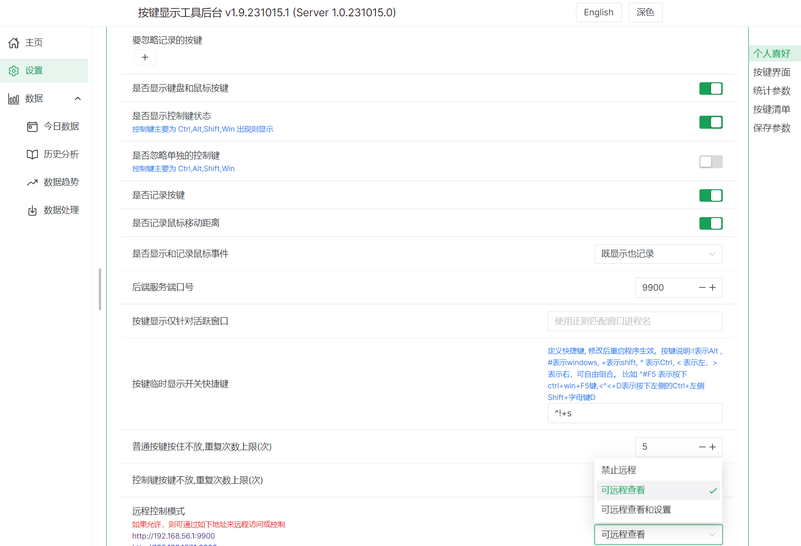
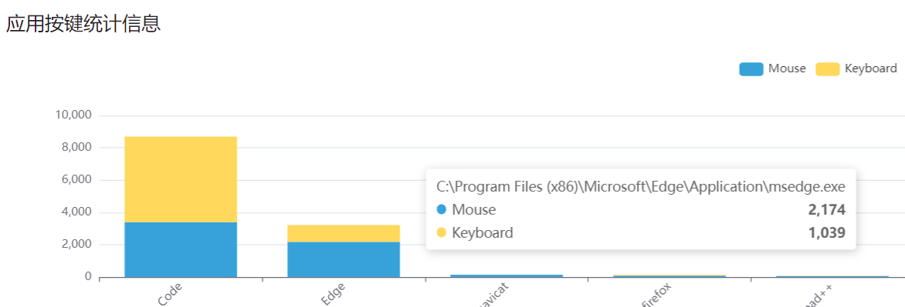
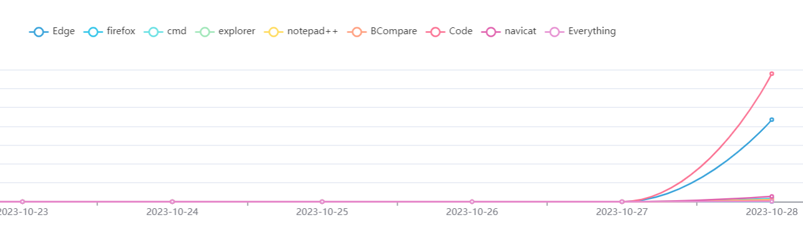

# showKeyBoard

[English](./readme.md) | [简体中文](./README_CN.md)

## 功能简介

1. 按键统计，可自定义键盘，查看统计数据
2. 按键显示，实时显示按键状态，支持窗口各类自定义，支持多屏，类似 Carnac 功能
3. 支持中英文切换和主题切换
4. 支持参数导入导出
5. 可支持远程统计和设置
6. 为了隐私安全，只记录统计信息，不记录具体内容，且内容保存在本地
7. 支持应用程序的鼠标和键盘使用统计

## 系统要求

1. Windows 64 位系统，推荐 Windows10 或 Windows11
2. 有现代浏览器（Edge/Chrome/FireFox 等）

## 使用方法

第一次安装或没有 node10 以上环境，安装

`ShowKeyBoard_Setup_版本_日期.exe`

直接解压可用如下版本，但是此版本升级时需要手工备份还原数据

`ShowKeyBoard_portable_版本_日期.exe`

如果有 node10 及以上环境或已经安装过一次，安装

`ShowKeyBoard_Setup_版本_日期(node).exe` 或 `ShowKeyBoard_Setup_版本_日期.node.exe` 

安装时根据提示进行选择，如是否保留配置，是否创建快捷方式等，一般使用默认配置即可

**注意**：
1. 由于使用了系统钩子，可能部分电脑上会误报病毒，需要信任。
2. 部分系统上可能需要使用管理员方式运行，否则不能监听到按键

## 截图演示

## 技术架构

按键监控客户端采用 AutoHotkey + Windows API

界面显示用 HTML，node 做 WebSocket 和 HTTP 通讯

客户端程序只管读取配置文件和发送数据，不写配置文件

HTTP 端负责写配置文件，接收 HTML 前端数据

## 编译说明

1. `http` 里面的是服务器端代码，使用 `npm run build` 打包，生成 `httpdist` 目录
2. `ui-helper` 是客户端配置页面 `npm run build` 生成 `dist` 目录，发布时候要放到 `httpdist/dist/ui` 目录中
3. 根目录是 AutoHotkey 脚本，需要用 AutoHotkey 工具对 `showKeyBoard.ahk` 打包为 exe，对应的 exe 文件需要放到和 `httpdist` 同级目录

## 目录说明

1. 根目录下的 `KeyList.txt` 键盘映射关系，`showKeyBoard.ini` 是客户端配置信息
2. 目录 `httpdist/dist/records.db` 文件保存按键的统计信息和统计的相关配置信息
3. 文件 `httpdist/dist/node.exe` 用于启动后端 `http/websocket` 服务

## 感谢

客户端功能参考 [KMCounter](https://github.com/telppa/KMCounter) 和 [Carnac](https://github.com/Code52/carnac) 的部分设计

UI 界面使用 [Naive UI](https://www.naiveui.com/) 框架