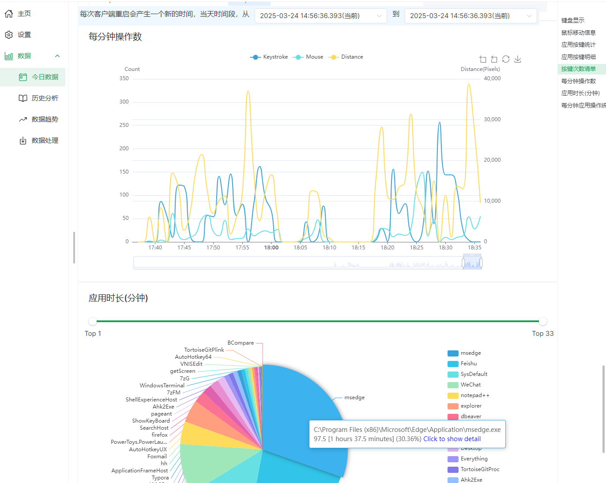

# showKeyBoard

[English](./readme.md) | [简体中文](./README_CN.md)

## Function Introduction

1. Key statistics with customizable keyboard, view statistics
2. Key display, real-time display of key status, supports multiple display styles for keys, such as rounded corners, fade out, custom movement directions, etc . , support for multiple screens, similar to Carnac
3. Support Chinese and English switching and light & dark theme switching
4. Support parameters import and export
5. Support remote statistics and settings
6. For privacy and security, showKeyBoard only records statistical information, do not record specific content, and save the content locally
7. Support the statstics of mouse and keyboard of different application programs
8. Supports the analysis of the usage time of each application. The basic principle is as follows: count the list of applications used every minute, and then allocate and summarize the usage time to each application,Note: The application requires mouse or keyboard operation.
9. Display the status of control keys/status keys in real-time, including the status of the Caps Lock, Scroll Lock, Num Lock keys, as well as the Ctrl, Shift, and Alt keys.
10. Show the last N keystrokes (not saved)
11. Support gamepad joystick and button detection.
12. Support the synchronization of multiple device records through third-party tools (FreeFileSync is recommended)

## System Requirements

1. Windows 64-bit system, Windows10 or Windows11 is recommended
2. Have a modern browser (Edge/Chrome/FireFox, etc.)

## How to use

Install for the first time, or do not have node10 or above environment, install

`ShowKeyBoard_Setup_(version)_(date).exe`

Unzip version as below,  please note that manual backup and restore of data is required when update

`ShowKeyBoard_portable_(version)_(date).exe`

If you have node10 or above environment, or have installed it once, install

`ShowKeyBoard_Setup_(version)_(date)(node).exe` or `ShowKeyBoard_Setup_(version)_(date).node.exe`

Follow the prompts to select during installation, such as whether to keep the configuration, whether to create a shortcut, etc. The default configuration can be used in general

**Note**:
1. Due to the use of system hooks, some computers may report viruses by mistake and need to be trusted.
2. On some systems, you may need to run in administrator mode, otherwise showKeyBoard will not be able to listen to the keys
3. Some companies may have installed encryption software, which will encrypt the configuration files, causing all parameters to become invalid. In this case, you can rename `./httpdist/dist/node.exe` in the installation directory to `./httpdist/dist/chrome.exe`, and modify the `showKeyBoard.ini` file in the installation directory by adding the parameter `serverExecName=./httpdist/dist/chrome.exe`.
4. If the system time is incorrect, for example, the time of a certain day changes to N years later, it may lead to the loss of application usage duration data. Please run the `fixStat修复统计数据.bat` file in the installation directory. 

### Synchronization
Here is an example of FreeFileSync synchronization FTP

1. First set the directory where shared files are saved. The default directory is share in the installation directory
2. Configure synchronization between local share and FTP server in FreeFileSync, and generate the synchronization file as ffs_batch file, such as Keyboard.ffs_batch
3. Set the **Interval hours for generating shared files** to indicate how often local records are packaged
4. Set the command to be automatically executed after packaging. If FreeFileSync is installed, you can directly execute the ffs_batch file. For example, the command can be configured as Keyboard.ffs_batch above
5. The share name defaults to the computer name, which can be changed by itself and will be displayed in the history and statistics module
6. The system will check the files in the shared file directory every minute and decompress them to the **dbs** directory. If there are updates, they will be decompressed again
7. In the history and statistics module, you can select and view the records of other devices after local decompression

分享

## Screenshot

## Technical Architecture

The key monitoring client uses AutoHotkey + Windows API

The interface display uses HTML, and node does WebSocket and HTTP communication

The client program only reads the configuration file and sends data, and does not write the configuration file

The HTTP side writes the configuration file and receives the HTML front-end data

## Compile Instructions

1. `http` is the server-side code, use `npm run build` to package and generate the `httpdist` directory
2. `ui-helper` is the client configuration page `npm run build` to generate the `dist` directory, which needs to be placed in the `httpdist/dist/ui` directory when publishing
3. The root directory is the AutoHotkey script, which needs to be packaged into exe with the AutoHotkey tool for `showKeyBoard.ahk`, and the corresponding exe file needs to be placed in the same level directory as `httpdist`

## Directory Description

1. `KeyList.txt` in the root directory saves key characters directory. `showKeyBoard.ini` saves the client configuration 
2. `httpdist/dist/records.db` saves the statistical information of the keys and the related configuration information of the statistics
3. `httpdist/dist/node.exe` is used to start the backend `http/websocket` service

## Issue

## Thanks

The client function refers to part of the design of [KMCounter](https://github.com/telppa/KMCounter) and [Carnac](https://github.com/Code52/carnac)

The UI interface uses the [Naive UI](https://www.naiveui.com/) framework